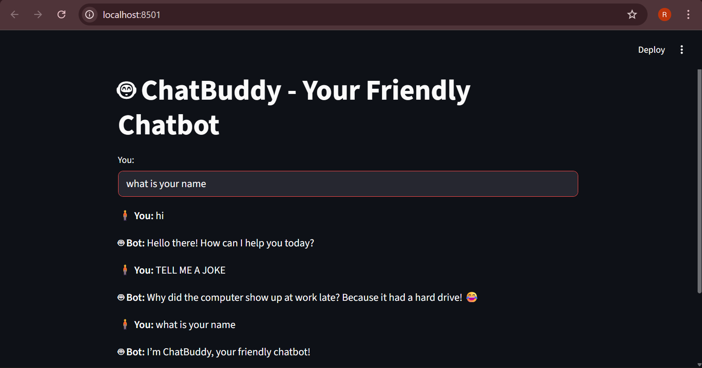

# 🤖 ChatBuddy - Friendly Chatbot

## 💡 Overview
ChatBuddy is a simple rule-based chatbot built using Python and Streamlit.  
It can greet users, answer basic questions, and chat casually.

## 🧠 Approach
- Built using a **rule-based** system.
- Deployed with **Streamlit** for a web interface.

## 🚀 How to Run
1. Clone this repository.
2. Install dependencies:
pip install streamlit
3. Run the app:
streamlit run app.py

## 🧩 Features
- Simple, interactive chat interface.
- Stores conversation history.
- Easily extendable with more responses.

## 🎥 Demo
